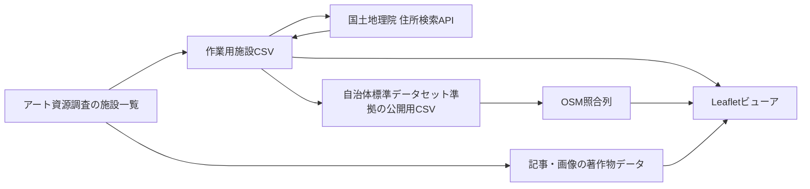

# さいたまアート資源マップ

アーツカウンシルさいたまの「アート資源調査」を起点に、さいたま市内の文化的な場所を地図から探し、記事や写真、位置情報、OpenStreetMap（OSM）の登録情報まで確認できるビューアです。

このリポジトリでは、公開しやすい施設データと、著作権のある記事・画像を意図的に分離しています。名称は調査範囲を明確にするため、画面・メタデータ・文書で「さいたまアート資源マップ」に統一しています。

## なぜこの構成にしているか

### オープンデータと著作物を混ぜない

施設名、所在地、座標など、オープンデータ候補として扱う情報は `data/open_data/` に置いています。公開用CSVは、デジタル庁の[自治体標準オープンデータセット（正式版）](https://www.digital.go.jp/resources/open_data/municipal-standard-data-set-test)「公共施設一覧」を参考にしています。

一方、アーツカウンシルさいたまの記事本文・写真は著作物です。これらは `data/copyrighted/` に分離し、公開用CSVへ混在させていません。ビューアは共通IDでブラウザ上結合します。この分離により、施設データだけを公開・更新する運用と、記事・画像の利用許諾を伴う表示を別々に判断できます。

現時点では公開用CSV自体のライセンスは確定していません。実際に公開する前に、公開主体、利用規約、施設情報の最新性を確認してください。

### 継続更新できる形にする

データ取得・変換を再実行できるスクリプトとして残し、元データID `id` と公開データID `ACS0001` 形式を固定しています。記事が更新されても、同じIDで位置情報、公開用データ、記事データ、画像、OSM照合結果を再結合できます。

場所の色分けは年度ではなく、記事名・キャッチコピー・本文から選んだ地図表示用の主分類です。公式分類ではありません。

- 展示・鑑賞
- 飲食・交流
- ものづくり・体験
- 本・買い物
- 地域・居場所
- 文化・自然

年度は全年度を初期表示とし、必要な年度だけを絞り込む項目として残しています。

### 国土地理院座標を説明可能にする

住所から国土地理院の住所検索APIで取得した緯度・経度、検索住所、結果住所、API URL、取得状態を元CSVに保持しています。ビューアの「国土地理院座標」モードでは、ポップアップと詳細画面で取得座標を確認できます。

住所検索結果は、建物入口や施設中心を保証するものではありません。公開前・更新時には施設の実在、住所、位置を確認してください。

### OpenStreetMapと連携する

国土地理院座標の周辺から、名称の全半角、記号、括弧内表記、英字表記などの揺れを考慮してOSM要素を照合しています。自動推定だけで誤結合しないよう、採用したOSM要素IDは `scripts/enrich_osm.py` の確認済み対応表に固定しています。

ビューアでは、OSM由来の名称、要素ID、分類、住所、営業時間、電話番号、ウェブサイト、車椅子対応、運営者等を詳細画面最下段の折りたたみ内に表示します。「推定一致」は確定情報ではないため、公開前の再確認が必要です。

OSM由来データを公開・再利用する際は、[OpenStreetMapの著作権とライセンス](https://www.openstreetmap.org/copyright)に従い、`© OpenStreetMap contributors` の表示とODbLへのリンクを維持してください。

## データの流れ



## 主なファイル

- `index.html`：静的ホスティング用の入口。`map.html`を開く
- `map.html`：データを埋め込んだPure HTML + JavaScript版ビューア。直接開いて利用可能
- `vendor/leaflet/`：静的版へ同梱したLeaflet.js 1.9.4
- `data/arts_council_saitama_art_resources_official_gsi_pending.csv`：施設、国土地理院座標、場所分類を含む作業用CSV
- `data/open_data/111007_public_facility.csv`：公開用候補CSV。OSM照合列を含む
- `data/copyrighted/arts_council_saitama_articles.csv`：記事・画像メタデータ。オープンデータ対象外
- `data/copyrighted/images/`：公式掲載画像から作成した表示用WebP。オープンデータ対象外

詳しい列定義と注意点は `data/open_data/README.md` と `data/copyrighted/README.md` を参照してください。

## 更新手順

```bash
# 1. 住所から国土地理院座標を更新
python3 scripts/geocode_gsi.py

# 2. OSM照合情報を更新
python3 scripts/enrich_osm.py

# 3. 公式記事を再取得
python3 scripts/scrape_artscouncil_articles.py

# 4. 記事画像をダウンロードし、長辺1280px・品質78のWebPへ変換
python3 scripts/download_article_images.py

# 5. 3つのCSVをmap.htmlへ埋め込み、静的版を再生成
python3 scripts/build_static_map.py
```

再取得後は、場所分類、公開用CSV、記事CSVを更新し、差分と権利条件を確認してください。記事・画像の取得と公開は、権利者の利用条件および必要な許諾の範囲内で行ってください。

## 静的版の表示

`index.html` または `map.html` をダブルクリックするか、ブラウザへドラッグすると `file://` のまま表示できます。施設CSV、記事CSV、OSM照合CSVはBase64としてHTML内に埋め込まれ、Leaflet.js本体も `vendor/leaflet/` から読み込むため、React、Node.js、ビルド環境、ローカルHTTPサーバーは不要です。

記事画像は `data/copyrighted/images/` のWebPを相対パスで表示します。このため、`map.html`、`data/`、`vendor/` の位置関係を維持してください。OpenStreetMapの背景地図タイル表示にはインターネット接続が必要です。

CSVを更新した場合は `python3 scripts/build_static_map.py` を再実行してください。

## 現在の収録状況

- 元調査：45件
- 国土地理院座標を確認し地図表示できる施設：37件
- OSM照合：一致5件、推定一致6件、該当なし26件
- 記事データ：45件
- 表示用WebP：143点

調査・取得日は2026-08-02です。施設の営業状況やウェブ情報は変化するため、継続的な確認を前提としています。
